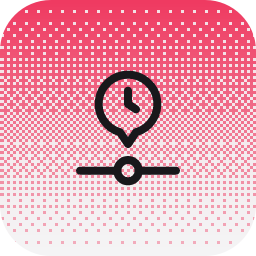

<p align="center">
  <picture>
    <source media="(prefers-color-scheme: dark)" srcset="./icon-dark.png" />
    
  </picture>
</p>

<div align="center">

# Timeline

</div>

A CapCut-style scrubber over Shadow's captured screen/input/window/audio lanes with keyframe preview, a Dayflow work journal, and jump-to-moment focus.

> **The public home of `ryu-timeline`.** Source, builds, and releases live here —
> binaries for every platform are attached to each release.
>
> This tree is generated from the Ryu monorepo, so commits pushed here
> directly are replaced on the next sync. **Pull requests are welcome** —
> open them here and they are ported into the monorepo, then flow back out.
> Ryu as a whole: https://github.com/amajorai/ryu

## Install

**App:** [Install](ryu://apps/@ryu/timeline) (opens the Ryu desktop app and asks you to confirm)

**CLI:**

```bash
ryu apps add @ryu/timeline
```

## Source & build

This is the **source of record** for the app UI. It imports Ryu's private
`@ryu/ui` design system, so it does **not** build standalone outside the
monorepo — it **builds inside the amajorai/ryu monorepo workspace**.
The **shipped bundle below is the built artifact**: a prebuilt single-file
companion bundle is included at [`dist/timeline.ui.html`](./dist/timeline.ui.html) —
the runnable UI Ryu loads for this app.

## License

Apache-2.0 — see [LICENSE](./LICENSE).

## Parts

- **`ui/` — companion (`@ryu/timeline-app`).** A sandboxed full-page Companion
  (Path B, `ui_format: "html"`), built to one self-contained `dist/index.html` via
  `vite-plugin-singlefile`, consuming `@ryu/ui` (tree-shaken into the bundle).
  No backend crate of its own — it reads Shadow's local `/timeline` + `/journal` +
  `/frame` endpoints through the bridge, every call over `window.ryu`.

## Manifest (`manifest.json`)

- **id** `@ryu/timeline` · one `companion` runnable (`Timeline`, icon `timeline`).
- **Grant:** `timeline:read` — the read-only bridge capability the companion drives
  Shadow's timeline/journal/frame surface through.
- No sidecar: the data lives in the already-running Shadow capture service.

## Surface

Registers as the **Timeline** companion in the desktop app store / launcher.
Read-only: switch between the CapCut-style **Replay** lanes and the chronological
**Timeline** history view, preview keyframes, browse the Dayflow journal, and jump
to a moment. The Timeline view groups derived work blocks by day and opens any
block back in Replay.

## Swap seam

The companion binds to the `timeline:read` capability, not to Shadow directly —
any capture backend that serves the same timeline/journal/frame contract behind
that grant can back the view without touching the UI.
